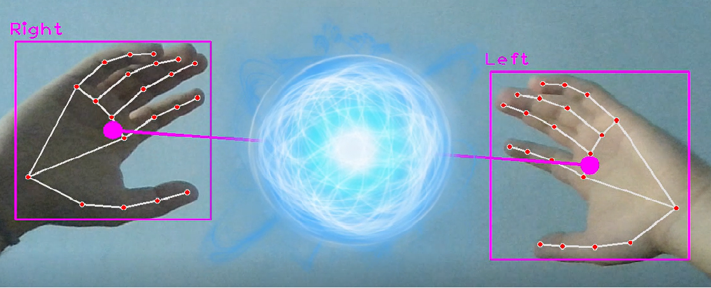

# Rasengan Barrage

Make resizable ransengan with your hands

### Using Pip

```sh
pip install -r requirements.txt
```

### Getting Started 
```sh
python start.py --help
Usage: start.py [OPTIONS]

Options:
  -e, --ext TEXT   extension of file to be rendered as rasengan. should be in
                   [png,gif,mp4]
  -f, --file TEXT  location of file to be renders as rasengan
  -s, --show       show hand overlay
  --help           Show this message and exit.
```

### Built With

- [Python](https://www.python.org/) - Programming language used
- [OpenCV](https://opencv.org/) - Open source computer vision library

### Example
```shell
python start.py -e png
```

